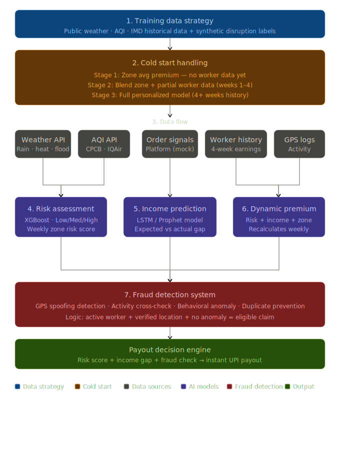
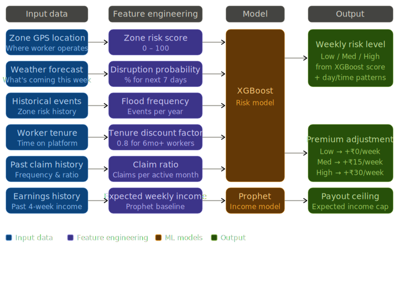

# 🛡️ Insurify — AI-Powered Parametric Insurance for Q-Commerce Delivery Workers

> **Guidewire DEVTrails 2026 | University Hackathon**
> Phase 1 Submission | Team: FutureForge

---

## 🎯 Our Idea

**Insurify** is an AI-enabled parametric insurance platform that automatically detects external disruptions and compensates Q-Commerce delivery workers (Zepto/Blinkit) for income loss — with **zero manual claims**.

---

## 💡 Problem Statement

> *"Delivery partners in quick-commerce platforms lose income when external disruptions reduce or stop order availability, even when they are active and ready to work. These disruptions are beyond their control, and currently, there is no automated financial protection system for such income loss."*

### Why Q-Commerce Workers Are Uniquely Vulnerable

Q-commerce delivery workers face a specific set of structural risks that make them more exposed than food or e-commerce delivery partners:

| Risk Factor | Impact |
|---|---|
| **Single Dark Store Dependency** | One store serves an entire zone. Store disruption = zero orders = zero income |
| **Strict 10-Minute SLA** | Any delay causes order cancellations and system slowdowns, reducing worker deliveries |
| **Hyper-Local Zones** | Workers operate in tiny zones — a local disruption has 100% impact |
| **External Weather Events** | Rain, flood, extreme heat halts deliveries entirely |
| **Social Disruptions** | Curfews, local strikes block access to pickup/drop zones |


---

## 👤 Persona

**Platform:** Zepto / Blinkit (Q-Commerce / Grocery Delivery)

**User Profile:**
- Delivery partner operating in a hyper-local zone (1–3 km radius)
- Earns ₹600–₹1,200/day depending on order volume
- Works 6–10 hours/day, operates week-to-week financially
- No existing financial safety net for disruption-based income loss

**Scenario Example:**
> Ravi is a Zepto delivery partner in Bangalore. On a Tuesday, heavy rainfall triggers a flood alert in his zone. His dark store halts operations. Despite being active and ready to work, Ravi receives zero orders for 6 hours and loses ~₹400. Under Insurify, the system detects the rainfall event, verifies Ravi was active, and automatically processes a payout — no claim needed.

---

## ⚙️ System Workflow

```
Worker Registers
       ↓
AI Calculates Weekly Premium (based on zone risk, history, weather forecast)
       ↓
Real-Time Monitoring (Weather APIs + Order Activity + Platform Signals + Behavioral Signals)
       ↓
Disruption Detected (Trigger fires)
       ↓
Worker Activity Verified (Was the worker online and active?)
       ↓
Fraud Detection Check (GPS validation, behavior analysis)
       ↓
Income Loss Calculated (Expected vs Actual income gap)
       ↓
Instant Payout Triggered (UPI / Wallet)
```

---


## ⚡ Parametric Triggers

<p align="center">
  
</p>

The system uses *parametric triggers* to automatically detect disruptions affecting gig workers.  
Instead of manual claims, payouts are triggered based on *real-time external data sources*.

### Additional Trigger: Platform / Market Disruption

GigShield also handles large-scale platform-level disruptions that are not caused by weather or local events.

*Market Crash / Platform Disruption Trigger:*
•⁠  ⁠Detects sudden drop in overall order volume across a zone or platform
•⁠  ⁠Can be caused by:
  - Platform outages
  - Dark store shutdowns
  - Supply chain failures
  - Economic or operational disruptions

**Trigger Tier Mapping (Added):**

| Disruption | Threshold | Tier | Payout |
|-----------|----------|------|--------|
| Platform Order Crash | >60% drop in zone orders (2+ hrs) | T2 | 50% weekly coverage |
| Full Platform Shutdown | >80% drop / dark store closed | T3 | 100% weekly coverage |

*Trigger Condition:*
•⁠  ⁠If zone-level order activity drops >70% compared to historical baseline  
•⁠  ⁠AND worker is active but receives significantly fewer/no orders  

→ System flags a *Market Disruption Event*

*Why this matters:*
This ensures GigShield protects workers not just from environmental risks, but also from *platform-side failures*, which are equally uncontrollable.

	⁠This makes the system more comprehensive and aligned with real-world gig economy risks.

### 🔍 How it works
•⁠  ⁠Monitors external signals (weather events, zone disruptions, civic alerts)
•⁠  ⁠Matches worker activity status in real-time
•⁠  ⁠Calculates income deviation from baseline
•⁠  ⁠Automatically triggers payout based on severity tier (T1–T3)

	⁠*Core Logic:* If (Trigger fires) AND (Worker is active) AND (Income drops) → Instant payout

---

---

## 💰 Weekly Pricing Model

GigShield uses a **weekly premium structure** aligned to the gig worker's earning cycle.

### Base Weekly Premium Tiers

| Plan | Weekly Premium | Coverage | Max Weekly Payout |
|---|---|---|---|
| Basic | ₹29/week | Up to 4 hrs/day loss | ₹500/week |
| Standard | ₹49/week | Up to 6 hrs/day loss | ₹900/week |
| Pro | ₹79/week | Full day loss | ₹1,500/week |

### AI-Adjusted Pricing Factors

The AI dynamically adjusts the base premium using:
- **Zone Risk Score** — historical flood/disruption frequency in the worker's zone
- **Seasonal Weather Forecast** — upcoming week's weather prediction
- **Worker Tenure** — longer-serving workers with clean claim history get discounts
- **Platform Reliability Score** — dark store uptime history in the zone

> Example: A worker in a flood-prone zone during monsoon season may pay ₹15 more/week than a worker in a low-risk zone.

---

## AI/ML Integration Plan

### Core AI Philosophy: Income Loss First

GigShield focuses on accurate income loss prediction combined with verified external triggers, instead of relying on multiple internal signals.

- Predict expected earnings for a worker using historical patterns
- Compare with actual earnings during disruption
- Calculate the exact income gap
- Trigger payout only if a valid external disruption is detected

> This ensures fairness, transparency, and prevents false payouts.

---

### Training Data Strategy

**The Cold Start Problem**

GigShield starts without real worker data. We solve this using a hybrid data strategy.

**Day 1 Data Sources:**
- Historical weather data (IMD + OpenWeatherMap API)
- Zone-level disruption history
- Synthetic income patterns

**Initial Model Training Approach:**
- Pre-train on weather + AQI datasets
- Generate synthetic disruption labels
- Simulate order volume patterns

**Phase 2+:**
- Replace synthetic data with real worker activity logs


> Note: GigShield primarily relies on external signals but can optionally integrate anonymized platform-level order data (mocked or API-based) to detect economic disruptions such as market crashes.

**New Worker Onboarding Strategy:**
- Week 1–2: Zone-based average risk and income
- Week 3–4: 70% zone + 30% worker data
- Week 5+: Fully personalized model

Model improves continuously with real usage.

<p align="center">
  
</p>

---

### How the AI System Works (End-to-End)

GigShield follows a structured AI pipeline from raw data to payout decision.

**Step 1: Data Collection**
- Weather APIs (rain, heat, flood alerts)
- Historical disruption records (zone-level)
- Worker earnings history (if available) OR simulated baseline for new users
- GPS activity logs

**Step 2: Cold Start Handling**
- New worker → uses zone-level average risk and income
- Gradually shifts to personalized model:
  - Week 1–2: 100% zone data
  - Week 3–4: 70% zone + 30% worker
  - Week 5+: Fully personalized

**Step 3: Feature Engineering**

Raw data is converted into:

| Raw Input | Engineered Feature |
|---|---|
| Zone GPS location | Zone Risk Score (0–100) |
| Weather forecast | Disruption Probability (%) |
| Historical disruption events | Flood / Event Frequency |
| Worker tenure | Tenure Factor |
| Past claim history | Claim Ratio |
| Earnings history | Expected Weekly Income |

**Step 4: Model Processing**
- XGBoost Model → predicts risk level (Low / Medium / High)
- Prophet Model → predicts expected income baseline

**Step 5: Decision Logic**

```
If (Trigger Detected)
AND (Worker Active)
AND (Actual Income < Expected Income)
AND (No Fraud Detected)
→ Trigger Payout
```

> Key Insight: GigShield primarily relies on external signals but can optionally use anonymized platform-level order signals (mocked or API-based) for detecting economic disruptions such as market crashes.

---

### Data Flow

<p align="center">
  
</p>

---

### Models Used

**1. Risk Assessment Model (XGBoost)**
- Predicts zone-level disruption risk
- Input: Zone location, historical disruption data, weather forecast, season
- Output: Low / Medium / High risk score → maps to premium adjustment

**2. Income Prediction Model (Prophet / LSTM)** *(Core model driving payouts)*
- Predicts expected worker earnings for the week
- Compares expected vs actual earnings during disruption
- Calculates the exact income loss gap
- Input: Worker's past 4-week earnings, day-of-week, time-of-day, weather

**3. Dynamic Premium Engine**
- Combines risk score + income prediction + zone conditions
- Recalculates every week before policy renewal
- Low risk → base premium, no adjustment
- Medium risk → base premium + ₹10–15/week
- High risk → base premium + ₹20–30/week

---

### Decision Engine (Final Payout Logic)

```
External Trigger + Worker Active + Income Gap + Fraud Check → Payout
```

---

### Fraud Detection System (Detailed Logic)

GigShield ensures only genuine claims are approved using multi-layer validation.

**1. GPS Spoofing Detection**
- IF (distance between consecutive GPS points > 5 km AND time < 60 sec)
  → Flag as GPS spoofing


**2. Activity Verification**
- Worker must be online in app and within delivery zone
- Cross-check active session logs and GPS movement consistency

**3. Behavioral Anomaly Detection**
- Track claim patterns: too frequent claims in short time, claims always during specific hours
- Flag if claim frequency exceeds threshold (e.g., >3 claims/week)

**4. Duplicate Claim Prevention**
- Each disruption event has a unique ID
- Worker can claim only once per event

**5. Income Manipulation Detection**
- IF worker logs in only during disruption windows repeatedly
  → Mark as high-risk behavior

**Fraud Logic:**
```
Valid GPS + Active Worker + Normal Behavior + Unique Event
→ Claim Approved
Else → Claim Rejected / Flagged
```

---

## 🛡️ Adversarial Defense & Anti-Spoofing Strategy

GigShield is designed to defend against coordinated fraud attacks where multiple actors attempt to exploit parametric triggers using GPS spoofing or synchronized behavior.

---

## 1. Differentiation: Genuine Worker vs Spoofed Actor

GigShield does not rely on GPS alone. Instead, it uses **multi-signal verification**:

- **GPS + movement continuity** — real path vs static spoof
- **Speed patterns** — real delivery vs unrealistic jumps
- **Activity density** — continuous work vs sudden login during disruption
- **Historical consistency** — past behavior vs anomaly

### Core Insight

> A real worker shows **continuous movement + order activity**,
> while a fraud actor shows **location presence without natural behavior patterns**.

---

## 2. Advanced Data Signals (Beyond GPS)

To detect coordinated fraud rings, GigShield analyzes:

| Signal | Description |
|---|---|
| **Device Fingerprinting** | Same device patterns across multiple accounts |
| **Network Patterns** | Multiple users from same IP range / VPN cluster |
| **Temporal Clustering** | Many claims triggered at the same timestamp |
| **Zone Anomaly Spikes** | Unusual surge of claims in a micro-zone |
| **Order vs Activity Mismatch** | Active users but zero realistic delivery flow |

### Group Fraud Detection Logic

```
IF (multiple users show identical patterns across location, timing, and behavior)
  → Flag as coordinated fraud cluster
```

---

## 3. Coordinated Attack Detection

GigShield introduces a **Fraud Graph Model**:

- **Nodes** = workers
- **Edges** = shared behavior patterns (location, timing, IP, device)

If a cluster of highly similar nodes emerges:
→ System flags a **fraud ring**

This enables GigShield to detect fraud at a **network level**, not just at an individual user level.

---

## 4. UX Balance: Protecting Honest Workers

GigShield avoids false rejections using a **tiered response system**:

| Suspicion Level | Action |
|---|---|
| 🟢 Low | Allow payout |
| 🟡 Medium | Delay + secondary verification |
| 🔴 High | Block + manual review flag |

### Fail-Safe Design

- Real workers experiencing genuine disruption are **never instantly penalized**
- System prioritizes **graceful degradation over hard rejection**

---

## 5. Adaptive Learning Loop

- Fraud patterns are continuously logged
- Models **retrain weekly** on new fraud signatures
- System becomes stronger against evolving attack strategies

---

## 🔐 Final Principle

GigShield treats fraud as a **dynamic adversarial problem**, not a static rule-based check.

This ensures resilience against:

- GPS spoofing apps
- Coordinated Telegram-based attacks
- Large-scale payout exploitation


---

### Output of AI System

| Output | Description |
|---|---|
| Weekly Risk Level | Low / Medium / High per worker per zone |
| Premium Adjustment | +₹0 / +₹15 / +₹30 per week |
| Expected Income | Baseline earnings predicted by Prophet model |
| Income Loss Gap | Expected minus actual earnings during disruption |
| Final Payout Decision | Approved / Rejected based on all checks |

---

## Core Features

| Feature | Description |
|---|---|
| **Parametric Trigger Engine** | Detects external disruptions using real-world data |
| **Automated Claim System** | Zero-touch claim processing |
| **Weekly Pricing Model** | Dynamic premium based on risk |
| **Income Prediction Engine** | Expected vs actual income calculation |
| **Fraud Detection System** | GPS + activity + behavior validation |
| **Worker Activity Verification** | Ensures worker was active during disruption |
| **Zone Risk Map** | Visual risk zones for workers |
| **Disruption Confidence Score** | Validates authenticity of disruption |
| **Dashboard (Worker + Admin)** | Real-time tracking and analytics |

---

## Minimum Viable Product (Phase 1 Scope)

**Phase 1 Focus:**
We intentionally limit scope to weather-based triggers and a simplified AI pipeline to demonstrate core system feasibility within hackathon constraints.

For Phase 1, GigShield focuses on building a working prototype with limited but critical functionality.

**Included in MVP:**
- Weather-based parametric trigger (rain/flood)
- Basic risk scoring (XGBoost — simplified)
- Income prediction (baseline using past averages)
- Worker activity verification (GPS + online status)
- Automated payout simulation (basic logic)

**Excluded in Phase 1 (Future Work):**
- Advanced fraud detection (behavioral ML)
- Full multi-trigger system (AQI, curfew, market crash scaling)
- Real payment integration (simulation only)
- Large-scale personalization

**Goal of MVP:**
To demonstrate end-to-end automated claim flow, income loss detection, and trigger-based payout system — while keeping the system realistic within hackathon constraints.

---

## Platform Choice

**Mobile Application (Android-first)**

- Real-time GPS tracking — required for fraud detection and worker activity verification
- Background monitoring — app tracks worker activity even when minimized
- Better reliability than web — works smoothly in low network conditions
- Push notifications — instant alerts for disruptions, risk warnings, payout confirmation
- Matches real user behavior — delivery workers already use mobile apps (Zepto, Blinkit, Swiggy)

GigShield leverages mobile capabilities to improve system reliability: continuous GPS tracking prevents spoofing, activity tracking ensures genuine worker participation, and device-level validation strengthens claim authenticity.

---

## Tech Stack

### Mobile App (Worker App)
- **React Native** — Cross-platform mobile app (Android-first)
- **Expo / Native APIs** — GPS, notifications, background tasks
- **Redux / Zustand** — State management

### Admin Dashboard (Web)
- **React.js + Tailwind CSS**
- **Recharts / Chart.js** — Analytics visualization

### Backend
- **Node.js + Express** — REST API server
- **Python (FastAPI)** — AI/ML model serving

### Database
- **PostgreSQL** — Worker data, policies, claims
- **Redis** — Real-time trigger caching

### AI/ML
- **Python (scikit-learn, XGBoost)** — Risk model
- **Prophet / LSTM** — Income prediction

### Integrations
- **OpenWeatherMap API** — Weather triggers
- **Government / News APIs** — Curfew detection
- **GPS / Device Sensors** — Worker tracking
- **Razorpay / UPI Simulator** — Payout processing

### Infrastructure
- **Docker**
- **Render / Railway**
- **Firebase (optional)** — Push notifications

---

## Development Plan

### Phase 1 (Mar 4–20): Problem Understanding & System Design ✅
- [x] Identified core problem: income loss due to external disruptions
- [x] Defined scope: focus only on worker income protection (not inventory or operations)
- [x] Analyzed Q-commerce system vulnerabilities (dark store dependency, hyperlocal zones)
- [x] Designed parametric insurance logic (external triggers + income gap)
- [x] Finalized AI approach (risk model + income prediction)
- [x] Defined fraud prevention strategy (GPS + activity verification)
- [x] Selected mobile-first architecture
- [x] Completed system architecture and README

### Phase 2 (Mar 21–Apr 4): Core System Implementation
- [ ] Build mobile app (worker onboarding + basic dashboard)
- [ ] Implement weekly insurance policy system
- [ ] Develop risk assessment model (XGBoost v1)
- [ ] Develop income prediction model (Prophet v1)
- [ ] Build parametric trigger engine (weather + external events)
- [ ] Implement worker activity verification (GPS + online status)
- [ ] Develop automated claim pipeline (trigger → verification → payout logic)
- [ ] Integrate basic fraud detection (location + duplicate checks)

### Phase 3 (Apr 5–17): Intelligence, Security & Demo
- [ ] Improve fraud detection (GPS spoofing + behavior analysis)
- [ ] Implement decision engine (risk + income gap + fraud check)
- [ ] Integrate payout simulation (UPI / Razorpay test mode)
- [ ] Build worker dashboard (risk level, earnings protection, payouts)
- [ ] Build admin dashboard (zone risk, claims monitoring, fraud alerts)
- [ ] Simulate disruption scenarios (rain / zone shutdown demo)
- [ ] Optimize AI models with test data
- [ ] Prepare final demo + pitch presentation

**Final Outcome:** By the end of Phase 3, GigShield will demonstrate real-time disruption detection, accurate income loss prediction, automated claim and payout system, and strong fraud prevention using mobile + AI.

---

## 👥 Team — FutureForge

| 👤 Name | 💼 Role |
|--------|--------|
| **Shreya Singh** | Backend + AI/ML *(Risk Model & Income Prediction)* |
| **Prince Kumar** | Backend + AI/ML *(API Development + Model Integration)* |
| **Kartik Srivastava** | Frontend + AI Integration *(Mobile App + API Integration)* |
| **Ameya Tharkral** | Frontend + UI/UX *(App Design + User Experience)* |
| **Abhinav Tripathi** | Frontend + AI Integration *(Dashboard + Data Visualization)* |

---


## 🔗 Links

- **GitHub Repository:** [https://github.com/ssshreya24/gigshield-zepto-Blinkit]
- **Demo Video (Phase 1):** [link to be added]


---

> Built with ❤️ for India's gig workers | Guidewire DEVTrails 2026
