# 🛡️ Insurify — Parametric Income Protection for Q-Commerce Delivery Workers

> **Guidewire DEVTrails 2026 | University Hackathon**
> Phase 2 Submission | Team: FutureForge

---

## 🎯 Our Idea

**Insurify** is a parametric insurance platform that automatically detects external disruptions and compensates Q-Commerce delivery workers (Zepto/Blinkit) for income loss — with **zero manual claims, zero paperwork, and instant UPI payouts**.

---

## 💡 Problem Statement

> *"Delivery partners in quick-commerce platforms lose income when external disruptions reduce or stop order availability, even when they are active and ready to work. These disruptions are beyond their control, and currently, there is no automated financial protection system for such income loss."*

### Why Q-Commerce Workers Are Uniquely Vulnerable

| Risk Factor | Impact |
|---|---|
| **Single Dark Store Dependency** | One store serves an entire zone. Store disruption = zero orders = zero income |
| **Strict 10-Minute SLA** | Any delay causes order cancellations and system slowdowns |
| **Hyper-Local Zones** | Workers operate in tiny zones — a local disruption has 100% impact |
| **External Weather Events** | Rain, flood, extreme heat halts deliveries entirely |
| **Social Disruptions** | Curfews, local strikes block access to pickup/drop zones |

---

## 👤 Persona

**Platform:** Zepto / Blinkit (Q-Commerce / Grocery Delivery)

**User Profile:**
- Delivery partner operating in a hyper-local zone (1–3 km radius)
- Earns ₹600–₹1,200/day depending on order volume
- Works 6–10 hours/day, operates week-to-week financially
- No existing financial safety net for disruption-based income loss

**Scenario Example:**
> Ravi is a Zepto delivery partner in Bangalore. On a Tuesday, heavy rainfall triggers a flood alert in his zone. His dark store halts operations. Despite being active and ready to work, Ravi receives zero orders for 6 hours and loses ~₹400. Under Insurify, the system detects the rainfall event, verifies Ravi was active, and automatically processes a payout — no claim needed.

---

## ⚙️ System Workflow

```
Worker Registers (Name + Phone + OTP Verification)
       ↓
AI Calculates Weekly Premium (Zone Risk + Weather + Tenure)
       ↓
Real-Time Monitoring (Weather Events + GPS + Platform Signals)
       ↓
Disruption Detected → Trigger Fires Automatically
       ↓
Worker Activity Verified (GPS + Online Status)
       ↓
Fraud Detection Check (GPS Validation + Behavior Analysis)
       ↓
Income Loss Calculated (Expected vs Actual Income Gap)
       ↓
Instant Payout Triggered → UPI / Wallet Credit
```

---

## System Architecture

> Full end-to-end architecture showing Flutter apps, Node.js backend, PostgreSQL database, and Docker deployment.



### Phase 1 — Concept & Design

> Our Phase 1 focused on system design, parametric trigger logic, and AI/ML architecture before any code was written.

.svg)

### Architecture Overview

| Layer | Technology | Purpose |
|---|---|---|
| **Worker App** | Flutter (iOS + Android) | Onboarding, OTP, Policy, Claims, Trigger alerts |
| **Admin App** | Flutter (separate app) | Dashboard, Analytics, Zone risk, Plan management |
| **Backend API** | Node.js + Express.js | 15+ REST endpoints, business logic modules |
| **Database** | PostgreSQL | Workers, policies, claims, payouts, triggers |
| **Deployment** | Docker + Docker Compose + Render | One-command cloud deployment |

---

## ⚡ Parametric Triggers

The system uses parametric triggers to automatically detect disruptions affecting gig workers. Instead of manual claims, payouts are triggered based on real-time external data sources.

### Trigger Coverage by Plan

| Trigger | Tier | Payout | Basic | Standard | Pro |
|---|---|---|---|---|---|
| Heavy Rain | T2 | 50% | ✅ | ✅ | ✅ |
| Extreme Heat | T1 | 25% | ✅ | ✅ | ✅ |
| Flood Alert | T3 | 100% | ❌ | ✅ | ✅ |
| Severe AQI | T2 | 50% | ❌ | ✅ | ✅ |
| Curfew | T3 | 100% | ❌ | ❌ | ✅ |
| Cyclone | T3 | 100% | ❌ | ❌ | ✅ |
| Platform Order Crash | T2 | 50% | ❌ | ✅ | ✅ |
| Full Platform Shutdown | T3 | 100% | ❌ | ❌ | ✅ |

### Core Trigger Logic

```
IF (Trigger Detected)
AND (Worker is Active in Zone)
AND (Income Drop Confirmed)
AND (Fraud Check Passed)
→ Instant Payout Released
```

---

## 💰 Weekly Pricing Model

### Base Weekly Premium Tiers

| Plan | Weekly Premium | Max Weekly Payout | Triggers Covered |
|---|---|---|---|
| Basic | ₹29/week | ₹500/week | 2 of 6 |
| Standard | ₹49/week | ₹900/week | 4 of 6 |
| Pro | ₹79/week | ₹1,500/week | 6 of 6 |

### AI-Adjusted Pricing Factors

The premium engine dynamically adjusts weekly rates using:

- **Zone Risk Score** — historical flood/disruption frequency
- **Seasonal Weather Forecast** — upcoming week prediction
- **Worker Tenure** — loyalty discounts for long-serving workers
- **Platform Reliability Score** — dark store uptime history in zone

> Example: Koramangala (High Risk) → Base ₹49 + Zone Adjustment ₹14 + Weather Risk ₹5 = **Final ₹68/week**

---

## 🤖 AI/ML Integration

### Core Philosophy: Income Loss First

Insurify focuses on accurate income loss prediction combined with verified external triggers.

```
Predict Expected Earnings → Compare with Actual → Calculate Income Gap → Trigger if Valid External Disruption
```

### Models Used

**1. Risk Assessment Model (XGBoost)**
- Input: Zone location, historical disruption data, weather forecast, season
- Output: LOW / MEDIUM / HIGH risk score → maps to premium adjustment

**2. Income Prediction Model (Prophet / LSTM)**
- Input: Worker's past 4-week earnings, day-of-week, time-of-day, weather
- Output: Expected income baseline → calculates income loss gap

**3. Dynamic Premium Engine**
- Combines risk score + income prediction + zone conditions
- Recalculates every week before policy renewal

### Decision Engine

```
External Trigger
     +
Worker Active (GPS verified)
     +
Income Gap Detected (Expected > Actual)
     +
Fraud Check Passed
     ↓
PAYOUT APPROVED ✅
```

### Fraud Detection System

**Multi-Layer Validation:**

| Check | Logic |
|---|---|
| GPS Spoofing | If distance > 5km in < 60 sec → Flag |
| Activity Verification | Worker must be online + in zone |
| Behavioral Anomaly | Claims > 3/week → Flag |
| Duplicate Prevention | One claim per unique disruption event ID |
| Income Manipulation | Login only during disruptions → High risk |

**Fraud Response Tiers:**

| Suspicion Level | Action |
|---|---|
| 🟢 Low | Allow payout immediately |
| 🟡 Medium | Delay + secondary verification |
| 🔴 High | Block + manual review flag |

---

## 📱 Phase 2 — What We Built

> In Phase 1 we designed the full system on paper. In Phase 2 we built it, deployed it, and ran it on real phones with a live backend and database.

---

### 🧭 Phase 1 → Phase 2 Journey

| Phase 1 (Design) | Phase 2 (Built) |
|---|---|
| Parametric trigger concept | Working trigger engine with node-cron |
| AI premium formula on paper | Live premiumEngine.js calculating real premiums |
| Wireframe onboarding flow | Full Flutter app with GPS + OTP |
| Fraud detection logic defined | GPS validation + duplicate prevention live |
| Architecture diagram | Deployed on Render with PostgreSQL |

---

### 📐 Phase 1 — System Design (What We Planned)

In Phase 1, our team spent 2.5 weeks doing deep problem analysis before writing a single line of code. We:

- Identified that Q-commerce workers face a **unique structural vulnerability** — hyper-local zones mean one disruption = 100% income loss
- Designed the **parametric trigger system** — real-world events automatically fire payouts without any manual claim
- Mapped out the **AI premium engine** — dynamic pricing based on zone risk, weather forecast, and worker tenure
- Defined **fraud detection layers** — GPS spoofing detection, behavioral anomaly flags, duplicate claim prevention
- Built the full **system architecture** — Flutter apps, Node.js backend, PostgreSQL, Docker

> 📊 See architecture and trigger design diagrams below

.svg)

**Phase 1 Demo:** https://youtu.be/62uDJHYd98Q

---

### 🏗️ Phase 2 — Full System Implementation

In Phase 2 we converted every design decision from Phase 1 into working code deployed on real infrastructure.

---

#### 👷 Worker App (Flutter — iOS + Android)

The worker app is the primary product — what a Zepto or Blinkit delivery partner installs and uses daily.

**Onboarding Flow:**
- 2-step signup — name, phone number, select delivery zone (GPS auto-detects)
- OTP verification screen — 6-digit code, 30-second countdown timer, shake animation on wrong entry
- Plan selection with **segmented control** — switch between "Weekly Premium" view and "Comparison" table to compare Basic / Standard / Pro side by side

**Policy Dashboard:**
- Live coverage status card showing plan name, premium paid, max payout, days remaining
- Trigger breakdown — which events are covered, at what payout tier
- Quick stats — remaining days, active triggers, fraud flags
- One-tap **PDF policy certificate** generation and download

**Auto Demo Trigger (Key Feature):**
- 5–10 seconds after login, a trigger fires automatically
- Calls `POST /demo/trigger` on the backend
- Simulates Heavy Rain / Flood / Extreme Heat / Severe AQI
- Immediately creates a claim and shows the payout flow

**Trigger Alert Flow (5-Screen Sequence):**
```
Screen 1: Trigger Detected    → Zone + Event type shown
Screen 2: GPS Verified        → Worker location confirmed in zone
Screen 3: Fraud Check Passed  → Clean behavior, no flags
Screen 4: Claim Approved      → Amount calculated from tier
Screen 5: Payout Animation    → ₹750 credited to UPI (simulated)
```

**Claims Tab:** Full history of all past claims with status, amount, trigger type, and date.

**Profile Tab:** Worker ID, zone, platform, plan, logout with confirmation dialog.

---

#### 🖥️ Admin App (Flutter — separate Android app)

The admin app gives the Insurify operations team full real-time visibility and control.

**Dashboard:**
- Live KPI cards — Total workers, active policies, total paid out, fraud flags
- Financial Summary — premiums collected this week, payout this week, loss ratio %
- Quick Actions — Manage Plans button + Fire Trigger button
- Demo Controls — fire Rain / Flood / Heat / AQI trigger for any zone with one tap
- Recent Triggers feed — shows last 5 triggered events

**Workers Tab:**
- Full list of all registered workers
- Each card shows name, zone, platform, plan, weekly premium, max payout
- Manage button → opens individual worker policy editor
- Search by name, zone, or platform

**Claims Feed:**
- Auto-refreshes every 10 seconds
- Filter by All / Approved / Processing / Rejected
- Each claim shows worker name, amount, trigger type, zone, timestamp

**Analytics Tab (Live):**
- Claims this week, total payout, premium revenue, fraud flags KPI grid
- Loss ratio progress bar with Healthy / Moderate / High Risk status
- Claims breakdown by zone (bar chart)
- Claims breakdown by trigger type

**Zones Tab:**
- All delivery zones shown with HIGH / MEDIUM / LOW risk level
- Risk score calculated from zone base risk + active trigger count
- One-tap fire trigger button on HIGH-risk zones
- Live active trigger count per zone

**Plan Manager:**
- Edit weekly premium and max payout for Basic / Standard / Pro
- Toggle plans ON / OFF with animated switch
- Shows full trigger coverage per plan

---

#### ⚙️ Backend API (Node.js + Express — Deployed on Render)

```
https://insurify-backend.onrender.com
```

**Core Modules:**

| Module | Purpose |
|---|---|
| `premiumEngine.js` | Calculates weekly premium: base + zone risk + weather risk − loyalty discount |
| `triggerEngine.js` | Runs on node-cron schedule, auto-fires triggers when thresholds crossed |
| `claimPipeline.js` | Creates claim + payout record when trigger fires, fraud checks included |
| `server.js` | 15+ REST endpoints: auth, policy, triggers, claims, admin, zones |
| `db.js` | PostgreSQL connection pool with SSL for Render |

**Key Endpoints:**
```
POST /register          → Worker signup + policy creation
GET  /signin            → Login by phone number
GET  /policy/:id        → Worker's active policy
POST /demo/trigger      → Fire demo trigger (auto + manual)
GET  /admin/stats       → Live KPI metrics
GET  /admin/workers     → All registered workers
GET  /admin/triggers    → Recent trigger events
PUT  /admin/policy/:id  → Edit worker policy
GET  /admin/zones       → Zone risk levels
```

---

#### 🗄️ Database (PostgreSQL 16 — Live on Render)

6 tables, seeded automatically from `init.sql`:

```
workers        → id, name, phone, zone, platform, avg_daily_income
policies       → worker_id, plan_type, weekly_premium, max_payout, active
trigger_events → zone, trigger_type, severity, value, status
claims         → worker_id, trigger_id, amount, status, fraud_flag
payouts        → claim_id, amount, upi_id, status
plan_types     → name, plan_key, weekly_premium, max_payout, is_active
```

---

#### 🚢 Deployment (Docker + Render)

- Backend packaged in Docker container with `Dockerfile`
- `docker-compose.yml` spins up API + PostgreSQL together locally
- Deployed to **Render** — auto-redeploys on every GitHub push
- Environment managed via `.env` file (DB credentials, port)
- Database hosted separately on **Render PostgreSQL** (free tier, Oregon region)

---

## 🚀 Live Deployment

| Service | URL / Info |
|---|---|
| **Backend API** | https://insurify-backend.onrender.com |
| **Health Check** | https://insurify-backend.onrender.com/health |
| **Database** | PostgreSQL on Render (Oregon) |
| **Worker APK** | [⬇️ Download Worker App](https://drive.google.com/file/d/1JSRpeNA95d1dxox6XoOLaP-NIGMwwCsG/view?usp=sharing) |
| **Admin APK** | [⬇️ Download Admin App](https://drive.google.com/file/d/1JSRpeNA95d1dxox6XoOLaP-NIGMwwCsG/view?usp=sharing) |

---

## 🛠️ Tech Stack

### Mobile Apps
- **Flutter + Dart** — Cross-platform iOS + Android (two separate apps)
- **http** — REST API calls
- **Geolocator** — GPS zone auto-detection
- **SharedPreferences** — Local worker_id storage
- **pdf** — Policy certificate generation

### Backend
- **Node.js + Express.js** — REST API server (server.js)
- **pg (node-postgres)** — PostgreSQL connection pool
- **node-cron** — Scheduled trigger detection
- **dotenv** — Environment config
- **cors** — Cross-origin support

### Database
- **PostgreSQL 16** — All persistent data
- **init.sql** — Auto-seeds schema on first boot

### Infrastructure
- **Docker + Docker Compose** — Containerised API + DB
- **Render** — Cloud deployment (backend + database)
- **Git + GitHub** — Version control + auto-deploy on push

### AI/ML (Planned Integration)
- **XGBoost** — Zone risk scoring
- **Prophet / LSTM** — Income prediction baseline
- **Python (FastAPI)** — AI model serving layer

### Dev Tools
- **VS Code** — Primary IDE
- **Postman** — API testing
- **Git + GitHub** — Source control

---

## 🏃 Running Locally

### Backend

```bash
cd Backend
cp .env.example .env
# Fill in DB credentials
docker-compose up --build
```

API runs at: `http://localhost:3000`

### Worker App

```bash
cd Frontend
flutter pub get
flutter run
```

### Admin App

```bash
cd admin_app
flutter pub get
flutter run
```

---

## Development Plan

### Phase 1 (Mar 4–20): Problem Understanding & System Design ✅

- [x] Identified core problem: income loss due to external disruptions
- [x] Defined scope: focus only on worker income protection
- [x] Analyzed Q-commerce system vulnerabilities (dark store dependency, hyperlocal zones)
- [x] Designed parametric insurance logic (external triggers + income gap)
- [x] Finalized AI approach (risk model + income prediction)
- [x] Defined fraud prevention strategy (GPS + activity verification)
- [x] Selected mobile-first architecture
- [x] Completed system architecture and README

### Phase 2 (Mar 21–Apr 5): Core System Implementation ✅

- [x] Built Flutter worker app (onboarding + OTP + policy dashboard + trigger flow)
- [x] Built Flutter admin app (dashboard + analytics + zone risk + plan management)
- [x] Implemented weekly insurance policy system (Basic / Standard / Pro)
- [x] Developed dynamic premium engine (zone risk + weather + tenure factors)
- [x] Built parametric trigger engine with node-cron scheduling
- [x] Implemented worker activity verification (GPS zone detection)
- [x] Developed automated claim pipeline (trigger → verification → payout)
- [x] Integrated basic fraud detection (duplicate prevention + GPS flags)
- [x] Deployed backend on Render with PostgreSQL cloud database
- [x] Built segmented plan comparison UI (Weekly Premium + Comparison tab)
- [x] Implemented auto demo trigger simulation (fires 5–10s after login)
- [x] Built full payout animation flow (step-by-step visual confirmation)
- [x] Created PDF policy certificate generator
- [x] Deployed both Android APKs for live demo

### Phase 3 (Apr 5–17): Intelligence, Security & Demo

- [ ] Integrate real weather APIs (IMD, OpenWeatherMap)
- [ ] Implement XGBoost risk model with real zone data
- [ ] Implement Prophet income prediction model
- [ ] Connect real UPI payouts via Razorpay test mode
- [ ] Advanced fraud detection (GPS spoofing + behavioral ML)
- [ ] Optimize AI models with real worker data
- [ ] Prepare final pitch presentation

---

## 📱 Download & Try

| App | Download |
|---|---|
| **Worker App (APK)** | [Download Insurify Worker](https://drive.google.com/file/d/1JSRpeNA95d1dxox6XoOLaP-NIGMwwCsG/view?usp=sharing) |
| **Admin App (APK)** | [Download Insurify Admin](https://drive.google.com/file/d/1JSRpeNA95d1dxox6XoOLaP-NIGMwwCsG/view?usp=sharing) |

> Install on any Android device. If blocked → Settings → Security → Allow Unknown Sources → Install.

**Admin Login Credentials:**
```
Email:    admin@gigshield.com
Password: gigshield@2026
```

---

## 🔗 Links

- **GitHub Repository:** https://github.com/ssshreya24/gigshield-zepto-Blinkit
- **Demo Video (Phase 1):** https://youtu.be/62uDJHYd98Q
- **Demo Video (Phase 2):** https://drive.google.com/file/d/1JSRpeNA95d1dxox6XoOLaP-NIGMwwCsG/view?usp=sharing
- **Live Backend:** https://insurify-backend.onrender.com/health

---

## 👥 Team — FutureForge

| 👤 Name | 💼 Role |
|--------|--------|
| **Shreya Singh** | Backend + AI/ML *(Risk Model & Income Prediction)* |
| **Prince Kumar** | Backend + AI/ML *(API Development + Model Integration)* |
| **Kartik Srivastava** | Frontend + AI Integration *(Mobile App + API Integration)* |
| **Ameya Tharkral** | Frontend + UI/UX *(App Design + User Experience)* |
| **Abhinav Tripathi** | Frontend + AI Integration *(Dashboard + Data Visualization)* |

---

> Built with ❤️ for India's gig workers | Guidewire DEVTrails 2026
