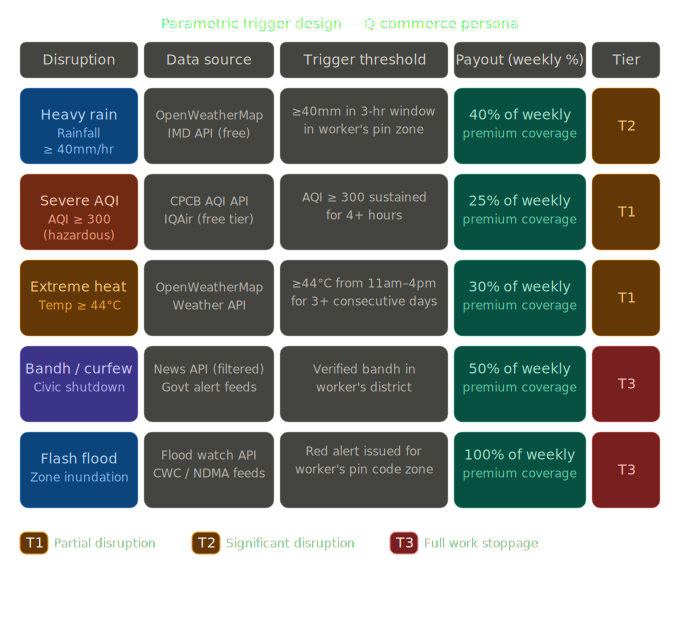

# 🛡️ GigShield — AI-Powered Parametric Insurance for Q-Commerce Delivery Workers

> **Guidewire DEVTrails 2026 | University Hackathon**
> Phase 1 Submission | Team: [Your Team Name]

---

## 🎯 Our Idea

**GigShield** is an AI-enabled parametric insurance platform that automatically detects external disruptions and compensates Q-Commerce delivery workers (Zepto/Blinkit) for income loss — with **zero manual claims**.

---

## 💡 Problem Statement

> *"Delivery partners in quick-commerce platforms lose income when external disruptions reduce or stop order availability, even when they are active and ready to work. These disruptions are beyond their control, and currently, there is no automated financial protection system for such income loss."*

### Why Q-Commerce Workers Are Uniquely Vulnerable

Q-commerce delivery workers face a specific set of structural risks that make them more exposed than food or e-commerce delivery partners:

| Risk Factor | Impact |
|---|---|
| **Single Dark Store Dependency** | One store serves an entire zone. Store disruption = zero orders = zero income |
| **Strict 10-Minute SLA** | Any delay causes order cancellations and system slowdowns, reducing worker deliveries |
| **Hyper-Local Zones** | Workers operate in tiny zones — a local disruption has 100% impact |
| **External Weather Events** | Rain, flood, extreme heat halts deliveries entirely |
| **Social Disruptions** | Curfews, local strikes block access to pickup/drop zones |

### What We Are NOT Solving
- ❌ Inventory loss or company loss
- ❌ Vehicle repair or health insurance
- ❌ Accident medical bills

### What We ARE Solving
- ✅ **Worker income loss** due to uncontrollable external disruptions only

---

## 👤 Persona

**Platform:** Zepto / Blinkit (Q-Commerce / Grocery Delivery)

**User Profile:**
- Delivery partner operating in a hyper-local zone (1–3 km radius)
- Earns ₹600–₹1,200/day depending on order volume
- Works 6–10 hours/day, operates week-to-week financially
- No existing financial safety net for disruption-based income loss

**Scenario Example:**
> Ravi is a Zepto delivery partner in Bangalore. On a Tuesday, heavy rainfall triggers a flood alert in his zone. His dark store halts operations. Despite being active and ready to work, Ravi receives zero orders for 6 hours and loses ~₹400. Under GigShield, the system detects the rainfall event, verifies Ravi was active, and automatically processes a payout — no claim needed.

---

## ⚙️ System Workflow

```
Worker Registers
       ↓
AI Calculates Weekly Premium (based on zone risk, history, weather forecast)
       ↓
Real-Time Monitoring (Weather APIs + Order Activity)
       ↓
Disruption Detected (Trigger fires)
       ↓
Worker Activity Verified (Was the worker online and active?)
       ↓
Fraud Detection Check (GPS validation, behavior analysis)
       ↓
Income Loss Calculated (Expected vs Actual income gap)
       ↓
Instant Payout Triggered (UPI / Wallet)
```

## ⚡ Parametric Triggers

<p align="center">
  
</p>

The system uses **parametric triggers** to automatically detect disruptions affecting gig workers.  
Instead of manual claims, payouts are triggered based on **real-time external data sources**.

### 🔍 How it works
- Monitors environmental & platform signals (weather, AQI, orders, alerts)
- Matches worker activity status in real-time
- Calculates income deviation from baseline
- Automatically triggers payout based on severity tier (T1–T3)

> **Core Logic:** If (Trigger fires) AND (Worker is active) AND (Income drops) → Instant payout

## 💰 Weekly Pricing Model

GigShield uses a **weekly premium structure** aligned to the gig worker's earning cycle.

### Base Weekly Premium Tiers

| Plan | Weekly Premium | Coverage | Max Weekly Payout |
|---|---|---|---|
| Basic | ₹29/week | Up to 4 hrs/day loss | ₹500/week |
| Standard | ₹49/week | Up to 6 hrs/day loss | ₹900/week |
| Pro | ₹79/week | Full day loss | ₹1,500/week |

### AI-Adjusted Pricing Factors

The AI dynamically adjusts the base premium using:
- **Zone Risk Score** — historical flood/disruption frequency in the worker's zone
- **Seasonal Weather Forecast** — upcoming week's weather prediction
- **Worker Tenure** — longer-serving workers with clean claim history get discounts
- **Platform Reliability Score** — dark store uptime history in the zone

> Example: A worker in a flood-prone zone during monsoon season may pay ₹15 more/week than a worker in a low-risk zone.

---

## 🧠 AI/ML Integration Plan

### 1. Risk Assessment Model
- Input: Zone location, historical disruption data, weather forecast, season
- Output: Weekly risk score (Low / Medium / High) → maps to premium adjustment
- Approach: Gradient Boosted Trees (XGBoost) trained on historical weather + claim data

### 2. Expected vs Actual Income Prediction
- Input: Worker's past 4-week earnings, day-of-week, time-of-day, weather
- Output: Expected income for the shift → compare with actual → calculate loss gap
- Approach: Time-series regression model (LSTM or Prophet)

### 3. Dynamic Premium Engine
- Combines Risk Score + Income Prediction + Zone data
- Recalculates every week before policy renewal
- Ensures premium is always proportional to real risk

### 4. Fraud Detection System
- **GPS Spoofing Detection:** Validate GPS coordinates against known delivery zone boundaries
- **Activity Verification:** Cross-check app online status with order attempt logs
- **Behavioral Anomaly Detection:** Flag unusual claim frequency or timing patterns
- **Duplicate Claim Prevention:** Hash-based deduplication on trigger events per worker

---

## 🔷 Core Features

| Feature | Description |
|---|---|
| **AI Risk Assessment** | Predict weekly risk level per worker per zone |
| **Weekly Pricing Model** | Dynamic weekly premium based on zone + risk + forecast |
| **Parametric Trigger Engine** | Real-time disruption detection from APIs (5 triggers) |
| **Automated Claim System** | Zero-touch claim — no manual filing needed |
| **Fraud Detection** | GPS validation + activity check + behavioral analysis |
| **Worker Activity Verification** | Confirm worker was online and active during disruption |
| **Zone Risk Map** | Visual map of disruption risk by delivery zone |
| **Disruption Confidence Score** | AI-generated confidence % that a disruption caused income loss |
| **Expected vs Actual Income AI** | Model that computes the exact income gap for payout |
| **Dashboard (Worker + Admin)** | Worker: coverage status & payouts. Admin: analytics & fraud |

---

## 🖥️ Platform Choice

**Web Application (Progressive Web App)**

**Justification:**
- Delivery workers use low-to-mid range Android phones — a PWA ensures lightweight, fast loading
- No app store dependency — workers can access via browser link
- Works offline for basic status viewing
- Admin dashboard best served on web for data visualization

---

## 🛠️ Tech Stack

### Frontend
- **React.js** (PWA) — Worker dashboard + onboarding
- **Tailwind CSS** — UI styling
- **Chart.js / Recharts** — Analytics dashboard

### Backend
- **Node.js + Express** — REST API server
- **Python (FastAPI)** — AI/ML model serving

### Database
- **PostgreSQL** — Worker profiles, policies, claims
- **Redis** — Real-time trigger state caching

### AI/ML
- **Python (scikit-learn, XGBoost, statsmodels)** — Risk + pricing models
- **TensorFlow Lite / Prophet** — Income prediction

### Integrations
- **OpenWeatherMap API** — Weather triggers (free tier)
- **CPCB AQI API** — Pollution trigger
- **News API (mock)** — Curfew/strike detection
- **Platform Order API (simulated)** — Order drop trigger
- **Razorpay Test Mode / UPI Simulator** — Payout processing

### Infrastructure
- **GitHub** — Version control
- **Railway / Render** — Deployment (free tier)
- **Docker** — Containerization

---

## 📅 Development Plan

### Phase 1 (Mar 4–20): Ideation & Foundation ✅
- [x] Problem definition and persona selection
- [x] Feature scoping and filtering
- [x] System architecture design
- [x] Tech stack finalization
- [x] README documentation

### Phase 2 (Mar 21–Apr 4): Build Core Platform
- [ ] Worker registration and onboarding flow
- [ ] Insurance policy creation with weekly pricing
- [ ] Dynamic premium calculation (AI model v1)
- [ ] Parametric trigger engine (3–5 triggers)
- [ ] Automated claims management
- [ ] Basic fraud detection

### Phase 3 (Apr 5–17): Scale & Polish
- [ ] Advanced fraud detection (GPS spoofing, behavioral)
- [ ] Instant payout simulation (Razorpay test mode)
- [ ] Full analytics dashboard (worker + admin)
- [ ] Disruption simulation demo
- [ ] Final pitch deck

---

## 👥 Team

| Name | Role |
|---|---|
| [Member 1] | Backend + AI/ML |
| [Member 2] | Frontend + UI/UX |
| [Member 3] | System Design + Integration |
| [Member 4] | Data + Fraud Detection |


---

## 🔗 Links

- **GitHub Repository:** [this repo]
- **Demo Video (Phase 1):** [link to be added]
- **Live Demo:** [link to be added]

---

> Built with ❤️ for India's gig workers | Guidewire DEVTrails 2026
